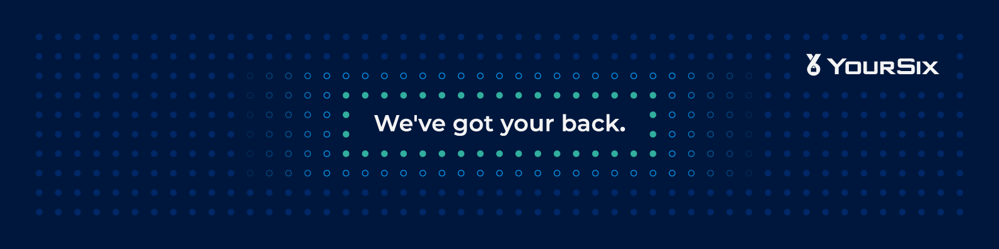

At YourSix, we make physical security simply brilliant. As a leading Physical
Security as a Service (PSaaS) provider, our direct-to-cloud Y6OS platform
eliminates traditional infrastructure, delivering advanced, scalable solutions
for video surveillance, access control, audio, and monitoring.

We believe open ecosystems drive innovation. That’s why we’re embracing open
source to extend the value of our platform, invite collaboration, and empower
developers to build with us. Whether you’re implementing event-driven workflows,
building custom webhook receivers, or extending system notifications—these
resources are here to help.

Explore our code, learn from our examples, and start building with us—bringing
intelligent, cloud-native physical security to life, no hardware headaches
required.

- [Learn more at YourSix.com](https://www.yoursix.com)
- [Explore career opportunities](https://www.yoursix.com/about/careers/)